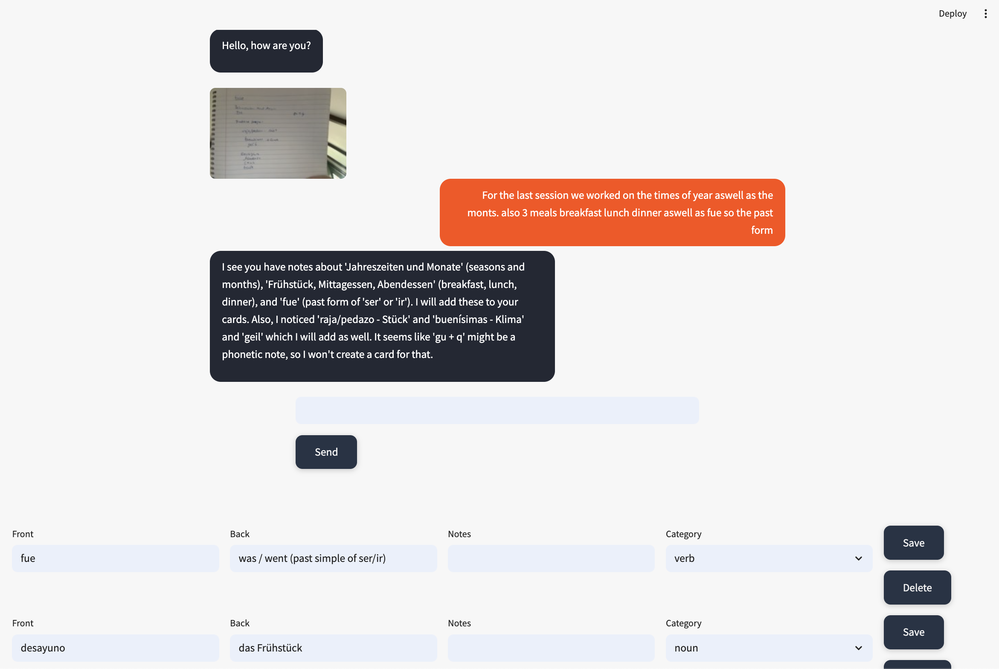

# Language Teacher

A minimal app to help you learn languages using spaced repetition (Anki-style) and AI-generated study plans.

## Features

- Create and review Anki cards (with audio) for vocabulary, grammar, and phrases.
- AI-assisted card generation from your notes or files.
- Generate personalized study plans using AI.

## Install

```bash
pip install uv
uv sync
```

## How it works

1. Start the app:
   ```bash
   streamlit run Language_Teacher.py
   ```
2. Enter or upload notes/images to generate new cards.
3. Review cards, edit, or practice sentences.
4. Generate and follow AI-powered study plans.


